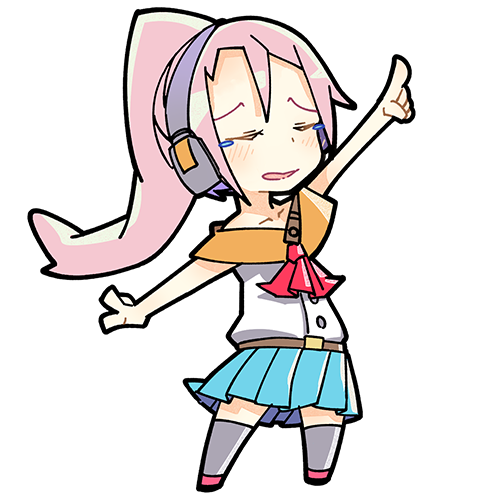

## 動画

{}

練習が捗る以下の事が行なえます。 
● 再生中に画面タップで一時停止しない 
● 再生範囲が設定出来る 
● 再生速度の調整が出来る 
● 動画画面の拡縮及び位置の移動が出来る 
 
苦手な箇所を低速再生しながら画面をタップするだけでも十分練習になります💪 ぜひ今日から繰り返し練習してみてください ♪~

{}
 

{}

動画選択画面の右上にある「端末が回転している」アイコンをタップする事で向きを変更出来ます。

{}
 

<!--
{}

アプリ内の「設定 > 動画上のタッチ サウンド」から、タッチ音の設定が行えます。 
タッチ音は色々な種類を用意していますので、お好きな音を選んでください ♪~

{}
 

{}

アプリ内の「設定 > 動画上のタッチ ポイント」から、タッチの表示設定が行えます。 
色と表示サイズも設定出来るのでお好みに合わせて調整してみてください ♪~

{}
 

{}

アプリ内では行えません。。。端末の音量を調整してください。 本当はアプリ内で調整したいのですが、その方法だと端末スペックによっては効果音の再生が大きく遅れてしまう機種がありました。利用端末の平均スペックが上がって来たら対応するかもしれません。

{}
 
-->

{}

一時停止ボタンをロングタップで反応するよう設定可能です。 
動画一覧画面の右上ボタンから「フォルダ設定 > 一時停止ボタン」からロングタップを選択する事で変更されます♪~

{}
 

<!--
{}

本アプリ内で音ズレを直す方法はありません。 いつか対応したいとは思っています。

{}
 
-->

{}

あります。動画一覧画面の右上ボタンから「フォルダ設定 > 早送り/巻き戻しボタン」から設定出来ます。 
動画画面上での秒数の指定も出来るので調整してみてください ♪~

{}
 

{}

位置変更は出来ませんが、非表示は行なえます。 動画一覧画面の左下にある「フォルダ設定 > 早送り/巻き戻しボタン」から設定出来ます。

{}
 

<!--
{}

元の動画解像度によりますが、240p/360p/720pから選べるようになっています。初期設定は360pです。 動画一覧画面の左下にある「共通設定 > 通信」から設定出来ます。

{}
 
-->

## 要望/バグの連絡

{}

アプリ内の動画一覧画面の右上の「フィードバック」から送ってください。対応出来るかは分かりませんが検討します。 GooglePlayのレビューでは意図を汲み取れきれず見送る事があるので、フィードバック先でのやり取りをオススメします。

{}
 

{}

アプリ内の動画一覧画面の右上の「フィードバック」から送ってください。対応出来るかは分かりませんが検討します。 GooglePlayのレビューでは意図を汲み取れきれず見送る事があるので、フィードバック先でのやり取りをオススメします。

{}
 

{}

すみません。。。バグの可能性が高いです。 
アプリ内の動画一覧画面の右上の「フィードバック」から、再生されない動画URLを含めて連絡ください。

{}
 

<!--
{}

カメラロールから動画を削除すると再生されなくなります。 写真をiCloudへ保存する設定にすると後日再生不可能になります。iCloudにアップロードされた動画の方をアプリへ登録ください。 カメラロールに動画があっても再生されない場合、アプリ/端末の再起動で問題が解決しないか試してみてください。

{}
-->

## その他

{}

課金導入には特定商取引法に基づき住所を公開する必要があるため、課金追加して広告除去アイテムの販売は行う予定がありません。

{}
 

{}

左上のメニューの寄付リンク先から受け付けています。 
頂いた寄付は生きるための糧とさせて頂きます。

{}
 